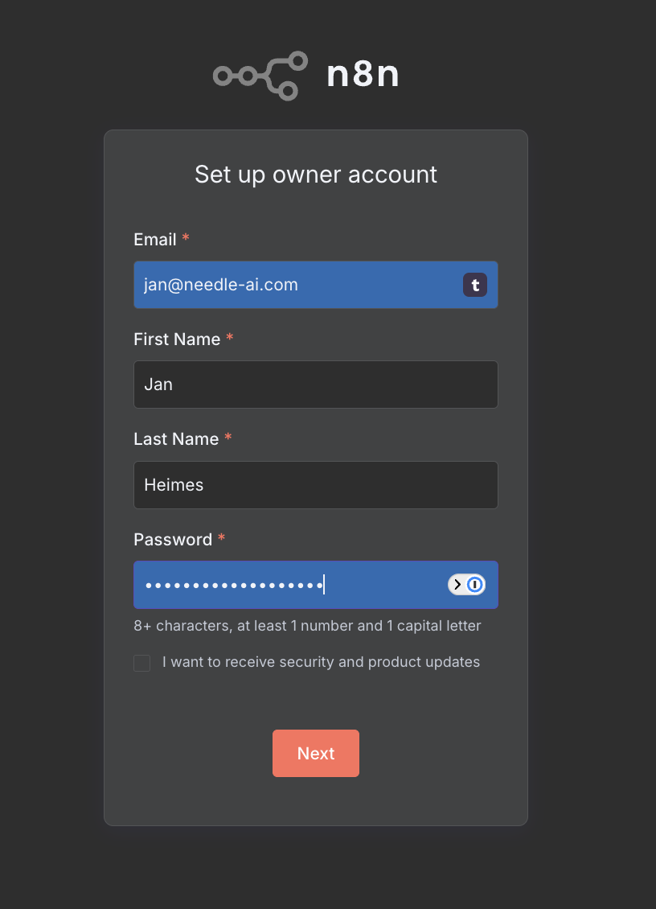
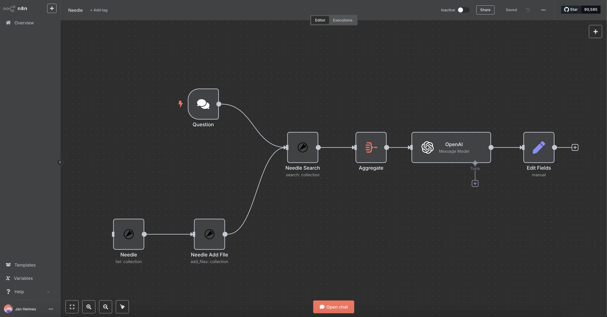

# Needle AI Integration for n8n

This package provides n8n nodes to interact with [Needle AI](https://needle-ai.com) - a powerful AI-powered information discovery and automation platform that helps you find information in seconds across all your connected data sources.

## Features

- **AI-Powered Search**: Find information across all your connected data with references
- **Collection Management**: List, search, and add files to your Needle collections
- **Semantic Search**: Perform powerful semantic searches across your documents
- **Seamless Integration**: Easily connect Needle AI with your n8n workflows

## Installation

This package requires pnpm as the package manager. Follow these steps to install the Needle AI n8n nodes:

1. If you haven't installed pnpm yet, install it globally:
   ```bash
   npm install -g pnpm
   ```

2. Navigate to your n8n custom nodes directory:
   ```bash
   cd ~/.n8n/custom/
   ```

3. Install the package using pnpm:
   ```bash
   pnpm add @needle-ai/needle-n8n-nodes
   ```

4. Start n8n to load the new nodes:
   ```bash
   n8n start
   ```

### Troubleshooting

If you encounter installation issues:

1. Make sure you're using pnpm (this package requires pnpm)
2. Ensure you have the correct Node.js version (n8n requires Node.js 16 or later)
3. Check if you have the necessary permissions in the custom nodes directory
4. If you see any build script warnings, you can safely ignore them as they don't affect functionality

## Usage

After installation, you can find the Needle node in the node panel by searching for "Needle".

### Authentication

To use the Needle node, you'll need to create credentials:

1. Get your API key from the [Needle AI Dashboard](https://app.needle-ai.com)
2. In n8n, create a new credential of type "Needle API"
3. Enter your API key in the credential form

### Available Operations

The Needle node supports the following operations:

#### Collection Resource

- **List**: Get a list of all your collections
- **Search**: Search within a specific collection using natural language
- **Add Files**: Add files to a collection

## Examples

### Search a Collection and Process Results

1. Add a Needle node to your workflow
2. Select "Collection" as the resource
3. Select "Search" as the operation
4. Enter your Collection ID
5. Provide a search prompt (e.g., "Find information about quarterly reports")
6. Connect the output to other nodes to process the search results

### Upload Files to a Collection

1. Add a Needle node to your workflow
2. Select "Collection" as the resource
3. Select "Add Files" as the operation
4. Enter your Collection ID
5. Add file information (name and URL)
6. Connect the output to see the upload results

### Real-World Use Cases

#### Automated Support Workflow

1. A new support ticket arrives
2. n8n captures the customer's question
3. Your workflow automatically adds or updates relevant documentation in Needle
4. Needle searches your knowledge base for the perfect answer
5. The information passes through an AI service for refinement
6. A comprehensive response gets delivered to your support system, Slack, or email

#### Other Applications

- **Streamline Onboarding**: Help new hires find information without flooding Slack with questions
- **Enhance Support**: Automatically search documentation for every new ticket
- **Empower Sales**: Give your team instant access to the latest decks and pricing information

## About Needle AI

Needle is your Knowledge Threading™ platform for work that helps you:

- **Save time**: According to McKinsey, employees spend 1.8 hours every day searching for information. Needle eliminates this waste.
- **Connect your data**: Quickly connect data sources like Google Drive, Dropbox, Confluence, and more.
- **Get answers instantly**: Say goodbye to communication bottlenecks and information silos.
- **Build AI agents**: Create powerful AI agents that interact with your data and automate sophisticated tasks.

With 10+ native integrations supported and enterprise-ready features, Needle helps you focus on what matters most.

## Troubleshooting

- **Error: Could not get parameter**: Make sure all required fields are filled out correctly
- **API Key is required**: Ensure your credentials are properly configured
- **At least one file is required**: When using "Add Files" operation, you must provide at least one file

## Support

For questions or issues with the node itself, please [open an issue](https://github.com/needle-ai/n8n-nodes-needle/issues).
For questions related to the Needle AI platform, please contact [support@needle-ai.com](mailto:support@needle-ai.com).

## Learn More

Check out our [blog post](https://blog.needle-ai.com/p/n8n-x-needle-supercharge-your-workflows) about the n8n integration to learn more about how Needle and n8n work together to supercharge your workflows.

## License

This project is licensed under the MIT License - see the LICENSE.md file for details.

## Screenshots

### n8n Login Screen


### Example Needle Workflow in n8n

